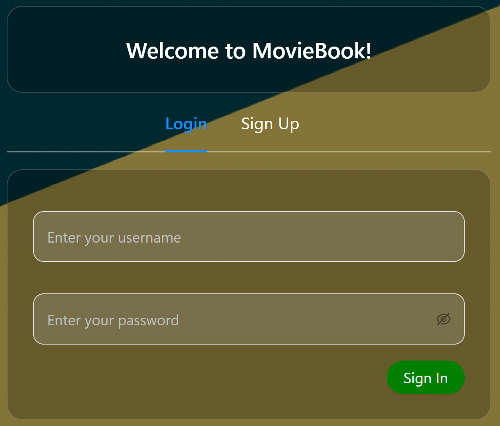
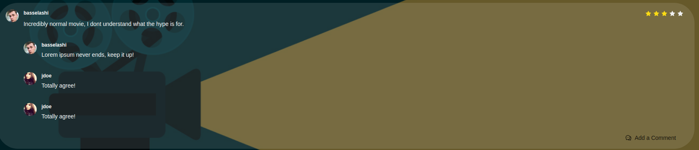
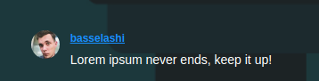
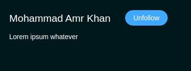
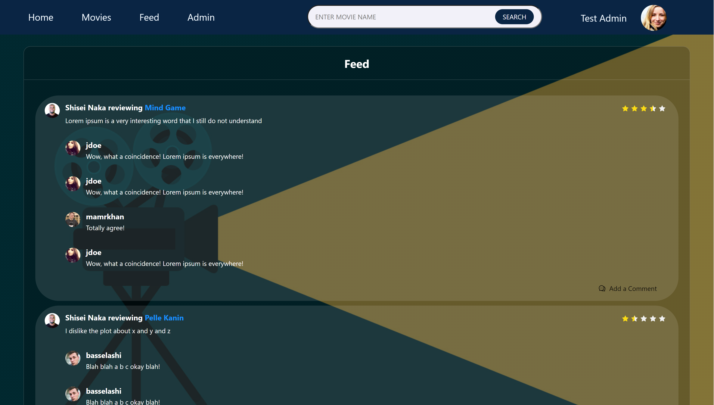

# TEAM02 - MovieBook

Welcome to MovieBook, a social media application for Movie Users.
Here is how to setup the web application and user it.

## Table of Contents
- [Setting Up MovieBook](#setting-up-moviebook)
  - [Running the Front-End](#run-the-front-end)
  - [Running the Back-End](#run-the-Back-end)
- [User Credentials](#user-credentials)
- [How To Use The Application](#how-to-use-the-application)
  - [Logging In](#logging-in)
  - [Looking At Movies](#looking-at-movies)
  - [Viewing Profiles](#viewing-profiles)
  - [Viewing User Feed](#viewing-user-feed)
  - [Administration Panel](#administration-panel-admins-only)
- [Libraries & Frameworks Used](#libraries--frameworks-used)

## Setting up MovieBook

From CLI run the command `git clone https://github.com/csc309-winter-2021/team02.git`

### Run the Front-End
From CLI navigate into the cloned directory

Run the command `npm install`

Wait for all the dependencies to be installed

Run the command `npm start`

The web application will be available on `http://localhost:3000`

### Running the Back-End
*This section will be completed during Phase 2*

## User Credentials

To login to the application, here are two sets of credentials

| Username | Password | Role |
| -------- | -------- | ---- |
| user | user | Regular User |
| admin | admin | Admin User |

## How To Use The Application

### Logging in

To login use the credentials provided above,  User are *user* or *admin*
Enter the credentials in the login form on the home page.  

Then click on the **Sign In** button

If the login in successful you will be authenticated to have access to different pages.
To sign out, you may click on the user's name in the navigation bar.

### Looking at Movies

The Default movies page is the gallery. Non-authenticated users can access this page.
It shows a list of movies as follows

#### Individual Movies
To look at an individual movie, you can click on the movie title in different places such
as in top movies, random movie, or feed.
For example, you can click on *View Movie* in top movies

This will take you the movie page.  

*Note: the movie that will show up is currently random but this will display the movie that is clicked once the back-end is implemented*

Here you will be able to view details and leave a comment or post *only if you are authenticated*. If not, then you can still
the view the movie

##### Leaving a Review
To leave a review, click on the button that says **+ Add a Review**
This will give you at text box where you can enter your review and leave a rating.
To save the review click on **Post Review** or to cancel click **Cancel Review**  

On the Movie page we can see comments and reviews that other users have left about the movie.

A review looks like this:  

##### Leaving a comment

Adding comments is a very similar procedure, click on the **Add a Comment** button located in the bottom right of the review.
This will open a textbox that will allow you to leave a comment.  
If you click on **Post Comment** the comment will be appended to the end of the review.  

### Viewing Profiles

We can visit profiles from the reviews page or in the random movie review by clicking on the user's name.  

Clicking on this will take us to the user profile.

Here you will see an image of the user, a follow button and several tabs.
The tabs show:
- Favourite Movies
- Review
- Recent Activity
- Profile Info

An example of a user profile is below:  

The follow button will toggle to the state of follow, that means that if you are following the user it will say *Unfollow* otherwise it will say *Follow*,
clicking on the button will update the state.

*Note: the user that will show up is currently random but this will display the user that is clicked once the back-end is implemented*

### Viewing User Feed

User feed displays reviews on movies from users that the authenticated user follows. As shown in the individual movie page,
users can also add comments to others' reviews.

### Administration Panel **(Admins Only)**

The admin panel is only available through the admin tab in the navigation bar (only appears for admins).
It can also be viewed from `http:localhost:3000/admin`

An example of the Admin Tab in the navigation bar is below:  

The Admin panel has two tabs:
- Users
- Movies

The users table can be used to promote users to admins or remote admin to regular users.
The admin just needs to click on the button.

For movies, admins are able to update the description of the movies.
When an Admin clicks on edit (to edit the movie description), a popup appears with the current description of the movie and a textbox to edit the description.  

The description will only be updated if the user clicks on *OK*.

### Sign Out

To sign out, simply click on your name in the Navigation bar.
*When you hover over the name it will turn red*

## Libraries & Frameworks Used
- React
- Ant Design
- React Slick

